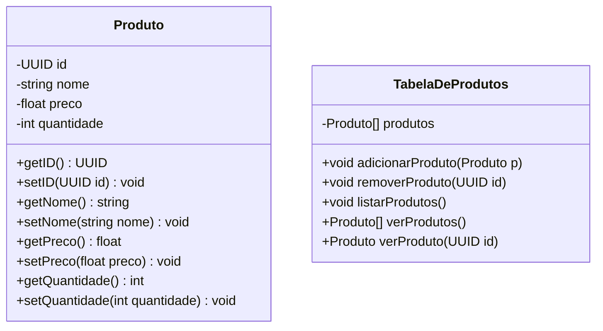

    <h1> Gerenciador de produtos </h1>

## Sobre o sistema

Será um gerenciador de produtos de um super mercado, onde podemos visualizar todos os produtos, visualizar os detalhes do produto, adicionar um produto, editar produto e deletar produto.

## Tecnologias

- Java 17
- Maven
- Spring
- Spring web

## Requisitos para utilização

- Ter o java jdk 17 instalado
- Ter o apache maven instalado e configurado

## Estrutura de pastas

- controller
- - ProdutoController.java
- repository
- - ProdutoRepository.java
- model
- - ProdutoModel.java
- - TabelaDeProduto.java
- CrudJavaSpringApplication.java

## Diagrama de Classe (Simulação de Tabela)

Este é um exemplo de como simular uma tabela de produtos usando Mermaid no Markdown.

